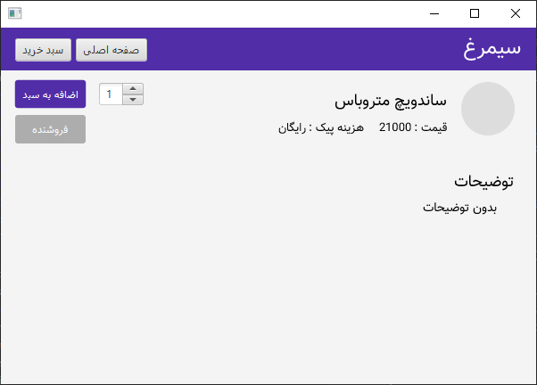

# Simorgh Food Ordering App

## Screenshots

#### Signup:

#### Login:

#### Food List:

#### Food:

#### Restaurant:

#### Cart:

#### recipe:

#### User Profile:

## How to Run
Use java 8 and start from main.java!

## UML
##### App models class diagram:

##### Navigation framework class diagram:

##### User Authentication diagram:

## Requirements Met

##### Exceptions:
- navigation Package
- storage.users.UserAPI

##### Inheritance:
- Food -> Product
- Restaurant -> Shop
- DynamicPage -> Page

##### Generics:
- Shop<T extends Product>

##### Interfaces:
- Main -> INavigation
- Restaurant -> RestaurantDeliveryPolicy
- Cart -> CartCallback

##### Overloading:
- Cart Class

##### Overriding:
- DynamicPage -> Page

##### Polymorphism:
- Navigation -> pages

##### Threads:
- UserAPI <-> AuthCallback

##### Regex:
- email format verification
- phone number format verification

##### Dependency Injection:
- Dynamic Pages -> Navigation

##### Dependency Diagrams:
- models
- navigation
- storage.users

##### outsider code:
- utils.PersianCalendar

##### Tracking codes:
- ali@simorgh.com: pg5veq, 1flpo42
